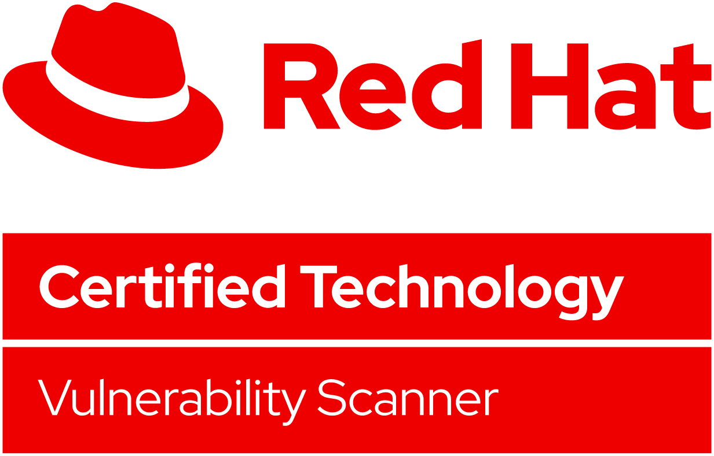

# Scanner



## Release Process

Scanner's release process does not have the same formalities as the rox repo at this time.
However, we continually work to improve it.

Every release for rox comes with a new Scanner release.

Scanner releases follow semantic versioning, and each new Scanner release updates the minor version (ie 2.x.0).
Only major, breaking changes will merit a bump to the major version, but this is unlikely to be the case in a normal release process.

### Creating a new Minor Release

1. [Create a genesis dump](#creating-genesis-dump).
1. Create a new branch `release/2.<new version>.x` based on the latest master once the genesis dump is updated
1. Create a new tag/release based on the new branch
1. Add release notes based on the changes between the previous release and this one
1. Once the latest image is built in CI, update the [SCANNER_VERSION](https://github.com/stackrox/stackrox/blob/master/SCANNER_VERSION) file in the rox repo

#### Creating Genesis Dump

The purpose of the gensis dump is to embedded the new release of Scanner with the most up-to-date vulnerability data, and reduce its startup time since only diffs will be fetched from the network, rather than the whole vulnerability content.

To run this:

- You have permissions to the related gcloud buckets,
- You have `gsutils` working locally.

Steps:

1. Look into the most recently completed run of the update-dumps-hourly workflow, and pick its ID.
2. Run `make genesis-dump GENESIS_DUMP_WORKFLOW_ID=<workflow-id>`. This will download the latest vulnerability data from the build, generate all the artifacts and diffs.
3. Run `make genesis-dump-commit GENESIS_DUMP_WORKFLOW_ID=<workflow-id>`. This will upload the artifacts to gcloud and add a new entry to `image/scanner/dump/genesis-manifests.json` in a branch called `genesis-dump/YEAR-MONTH-DAY`.

You can also run `make genesis-dump-all GENESIS_DUMP_WORKFLOW_ID=<workflow-id>` to run (1.) and (2.)

Finally:

- Review the changes in `genesis-dump/YEAR-MONTH-DAY`.
- Push `genesis-dump/YEAR-MONTH-DAY` to origin and create a PR ([example](https://github.com/stackrox/scanner/pull/191)).
- Add the `generate-dumps-on-pr` label to the PR.

Then, the CircleCI jobs on the PR should generate a `diff.zip` inside a definitions.stackrox.io bucket named with the UUID used in the entry appended to `genesis-manifest.json` file. Scanners will use it for updates once the PR is merged.

Full details at [Red Hat's engineering wiki](https://docs.engineering.redhat.com/display/ENGKB/How+to+update+the+scanner+genesis+dump).

### Creating a new Patch Release

1. Merge any updates into the `master` branch
1. Once merged, `git cherry-pick` the commit(s) into the relevant release branch(es)

Note: There is no genesis-dump update for patch releases (unless the patch, itself, requires it)

## Building

### Prerequisites

* [Make](https://www.gnu.org/software/make/)
* [Go](https://golang.org/dl/)
    * Get the version specified in [go.mod](go.mod)
* Various tools that can be installed with `make reinstall-dev-tools`.
    * Running the reinstall is especially important to do if you tend to switch between this and rox.

### Steps

If this is your first time, run the following:

```
$ make build-updater
$ ./bin/updater generate-dump --out-file image/scanner/dump/dump.zip
$ unzip image/scanner/dump/dump.zip -d image/scanner/dump
$ gsutil cp gs://stackrox-scanner-ci-vuln-dump/pg-definitions.sql.gz image/db/dump/definitions.sql.gz
$ make image
```

For any other time, just run `make image`.

## Testing

There are various unit tests and bench tests scattered around the codebase.

On top of that, there are E2E tests defined in the `e2etests/` directory,
and there are some DB integration tests defined in `database/psql`.

### Unit Tests

To run these, simply run `make unit-tests`

### Bench Tests

There are several ways to run benchmarks. For the best results, run these tests via
the command line, as you will have more control over the settings.

To run go benchmarks, run the following:

```
// Run all benchmarks
$ go test -run=^$ -bench=. ./...

// Only run a specific benchmark for 2 minutes
$ go test -run=^$ -bench=^BenchmarkSpecific$ -benchtime=2m ./<PATH_TO_DIRECTORY_WITH_TEST>

// Gather profiles for specific benchmark
$ go test -run=^$ -bench=^BenchmarkSpecific$ -benchmem -memprofile memprofile.out -cpuprofile cpuprofile.out ./<PATH_TO_DIRECTORY_WITH_TEST>
```

### E2E Tests

E2E tests run in CI upon every commit. Sometimes,
changes are made which affect the genesis dumps. To test these,
simple add the `generate-dumps-on-pr` label to your PR.

### DB Integration Tests

DB integration tests also run in CI upon every commit.
However, to test these locally, be sure to [install PostgreSQL 12](https://postgresapp.com/downloads.html)
and run it prior to running the tests.
